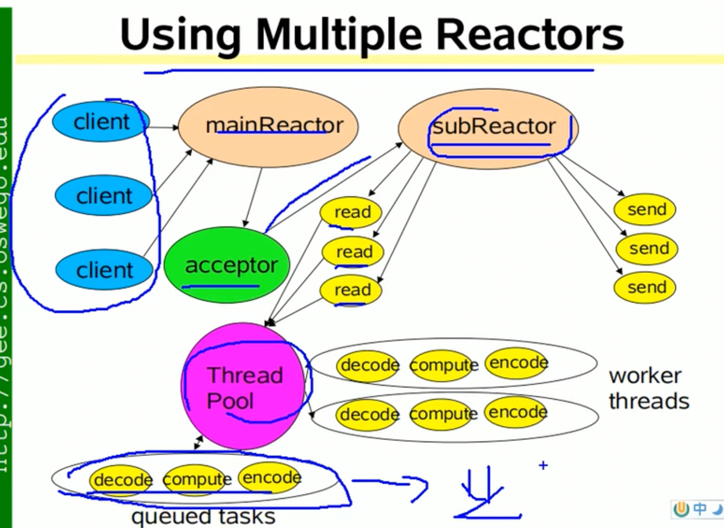

# Netty 源码分析

## NIO
基于事件的同步非阻塞的网络模型，

### 三大组件
- Selector
- Channel
- Buffer

三大组件的关系是：一个selector对应多个channel，一个channel对应一个buffer，一个buffer对应一个客户端连接。
而一个线程对应一个selector，这样的话，一个线程可以处理多个客户端连接。

selector可以根据不同的事件在不同的channel上切换。

#### Buffer（缓冲区）
就是一个可以读写数据的内存区域，底层使用的是一个数组当作容器的。它在java.nio包下，是一个抽象类。

#### Channel（通道）
在java.nio.channels包下，是一个接口。
- 通道可以同时读写，而流只能读或者写。
- 通道可以实现异步读写数据
- 通道可以写数据到缓冲区，也可以从缓冲区中读取数据。

#### Selector（选择器）
用来监听Channel中的事件。

### 零拷贝技术
有两种
- mmap
- sendfile

#### mmap 内存映射技术
将文件映射到内核缓冲区中，同时，用户空间可以共享内核空间的数据，这样在网络传输时，就不需要从内核空间拷贝到用户空间。

#### sendfile
linux2.1版本，提供了sendfile函数，数据不用经过用户态，直接从内核缓冲区拷贝到 socket buffer，
同时，由于和用户态无关，减少了一次上下文切换。
在linux2.4版本，做了一些优化，直接从内核缓冲区拷贝到协议栈，从而再一次减少了数据拷贝。

### NIO的问题
- 类库和api使用起来麻烦
- 开发量和难度较大，需要处理问题较多，比如 客户端断链重连，网络闪断，网络拥塞等问题。
- NIO的bug，比如Epoll bug，会导致selector空轮询，最终导致cpu 100%。

## Netty
是一个异步的，事件驱动的网络应用程序框架，主要用来快速开发高性能的网络IO程序。

### 线程模型
- 传统阻塞IO模型
  - 每个连接都要独立的线程来处理
  - 阻塞IO模式获取输入的数据。
  - 会占用大量系统资源，造成资源的浪费。
- Reactor模式
  - 基于事件驱动
  - 基于IO复用模型监听事件，收到事件后，分发给某个线程。。
  - 一个线程可以处理多个连接。
  - 多个连接共用一个阻塞对象，应用程序无需阻塞等待所有连接

核心组成：
- Reactor：在一个单独的线程中运行，负责监听和分发事件，
- Handlers：实际的事件处理器。

模式分类：
根据Reactor的数量和处理资源的线程的数量不同，有3中典型的实现
- 单Reactor单线程：就是使用一个线程完成所有IO操作，包括连接、读、写等操作。
  - 缺点：无法发挥多核的优势。
  - 优点：简单。
  - 使用场景：当业务处理速度很快，比如Redis。
- 单Reactor多线程：业务处理使用线程池来处理。
  - 优点：充分利用多核CPU的能力。
  - 缺点：reactor处理事件的监听和响应，高并发场景会出现性能瓶颈。

- 主从Reactor多线程：
  - 主Reactor负责监听连接事件，然后将事件分配给子Reactor，子Reactor将连接放入到队列中然后监听，
  - 当某个连接有事件发生时，子Reactor会调用对应的handler处理。其他的和单Reactor多线程一样了。
  - 一个主Reactor可以有多个子Reactor

原理图：

应用场景：Nginx、Netty

**NettyIO模型**
- 首先有两组线程池，BossGroup负责接收客户端连接，WorkerGroup负责网络读写操作。
- NioEventLoop 表示一个不断执行任务的线程，都有一个selector，用于监听channel。
- NioEventLoop 负责消息的读取，解码，处理，编码，发送。
- NioEventLoopGroup 包含多个NioEventLoop。
- 一个NioEventLoop包含一个selector和taskQueue。

